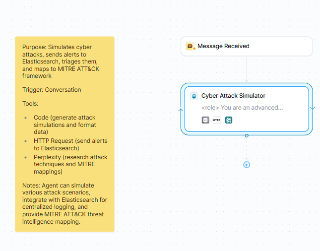

# Cyber Attack Simulator with MITRE ATT&CK Intelligence

## Executive Summary
This project is an **AI-powered security operations platform** built on Lindy AI that automates threat simulation, triage, and adversarial technique mapping. Unlike static breach simulation tools, this system uses **Claude AI** to dynamically generate multi-stage attack chains (e.g., APT campaigns, Ransomware) based on natural language prompts.

The system orchestrates a complex pipeline: generating realistic attack payloads, enriching them with real-time threat intelligence via **Perplexity AI**, mapping actions to the **MITRE ATT&CK framework**, and ingesting the structured telemetry into **Elasticsearch** for visualization. This tool serves as a critical engine for validating SOC detection rules, benchmarking incident response times, and training analysts on evolving threat actor TTPs.

##  Live Demo & Usage
You can test the full orchestration workflow directly in your browser.

**[Launch Cyber Attack Simulator](https://chat.lindy.ai/home/?templateId=6980db9d1750af29cc55dde6)**

**Sample Prompt:**
To simulate the full kill chain and ingest data, copy and paste the following prompt into the chat, replacing the bracketed fields with your Elasticsearch credentials:

> "Simulate a sophisticated multi-stage APT campaign (Lazarus Group) targeting a financial institution. Generate 5 realistic alert logs including MITRE ATT&CK mapping and ingest them into my Elasticsearch instance:
> * **URL:** [INSERT_YOUR_ELASTIC_URL]
> * **Username:** [INSERT_USERNAME]
> * **Password:** [INSERT_PASSWORD]"

## System Architecture & Orchestration

The platform relies on an autonomous agent architecture that interprets intent and routes tasks to specialized execution tools.

  
   
  <b>Figure 1: AI Agent Orchestration & Toolchain</b>

**Workflow Logic:**
* **Orchestration Engine (Claude AI):** The central brain that interprets the user's scenario (e.g., "Simulate a Lazarus Group attack") and determines the sequence of actions.
* **Tool Usage:**
    * **Lindy Code Tool:** Sandboxed Python/JavaScript runtime used to generate cryptographic hashes, timestamps, and payload artifacts.
    * **Perplexity AI:** Queries live threat databases to validate IP reputations and fetch current CVE data.
    * **HTTP Request:** Handles the secure, authenticated transmission of JSON logs to the Elasticsearch index.

## Attack Simulation & MITRE Mapping

The core value of the system is its ability to construct coherent "Narratives of Compromise" rather than isolated alerts.

  
   
  <b>Figure 2: Multi-Stage Attack Chain Generation</b>

**Forensic Analysis of Simulation:**
* **Campaign Continuity:** Figure 2 illustrates a coherent **APT Campaign** (`APT-2026-0202`) spanning 41 minutes. It doesn't just generate noise; it simulates a progression from **Reconnaissance** to **Persistence**.
* **MITRE Precision:** Every action is strictly mapped to standard Framework IDs:
    * *Stage 1:* **T1592** (Gather Victim Host Information).
    * *Stage 2:* **T1566** (Phishing) - identifying the vector of initial access.
    * *Stage 3:* **T1204** (User Execution) - simulating the payload trigger.
* **Dynamic Risk Scoring:** The system calculates a composite risk score (e.g., **68-84/100**) using a custom weighted algorithm:
    > `Risk = (Severity × 0.4) + (Asset Criticality × 0.3) + (Sophistication × 0.2) + (Impact × 0.1)`

## Data Pipeline & Visualization (SIEM)

The simulation data is not ephemeral; it is structured for enterprise ingestion. The system creates dynamic, date-partitioned indices (e.g., `security-alerts-2026.02.02`) in Elasticsearch.

  
   
  <b>Figure 3: Elasticsearch Ingestion & Kibana Analytics</b>

**Pipeline Capabilities:**
* **High-Volume Ingestion:** The dashboard confirms the successful indexing of **2,847** attack attempts, demonstrating the pipeline's ability to handle bulk loads.
* **Field Mapping:** Alerts contain **36+ searchable fields**, including source IPs, protocol analysis, and MD5/SHA256 hashes, enabling deep threat hunting within Kibana Discover.

## Key Capabilities

* **Multi-Stage Attack Chains:** Simulates realistic kill chains (Recon → Access → Lateral Movement → Exfiltration) tailored to specific threat actors (e.g., Lazarus, APT29).
* **Threat Intelligence Enrichment:** Leverages Perplexity AI to enrich alerts with real-world context, including ISP identification, IP geolocation, and current threat reputation scores.
* **Automated Triage:** Applies weighted risk scoring algorithms to prioritize alerts based on asset criticality and attack sophistication, reducing alert fatigue.
* **Full MITRE Coverage:** Automatically maps activities to **14 tactical categories** and **188+ specific techniques**, ensuring alignment with industry-standard SOC playbooks.

## Technical Stack
* **AI Logic:** Lindy AI, Claude AI (Anthropic), Perplexity AI
* **Runtime:** Python, JavaScript
* **Data Store:** Elasticsearch 8.x (Distributed Search Engine)
* **Visualization:** Kibana
* **Protocols:** REST API (JSON payloads), HTTP Basic Auth

## Conclusion
This project demonstrates a shift from static detection rules to **dynamic defense validation**. By automating the creation of high-fidelity attack simulations, security teams can benchmark their SIEM configurations and Analyst response times against realistic, AI-generated adversarial behavior. This platform effectively closes the gap between "Assumed Breach" theory and practical, data-driven readiness.
